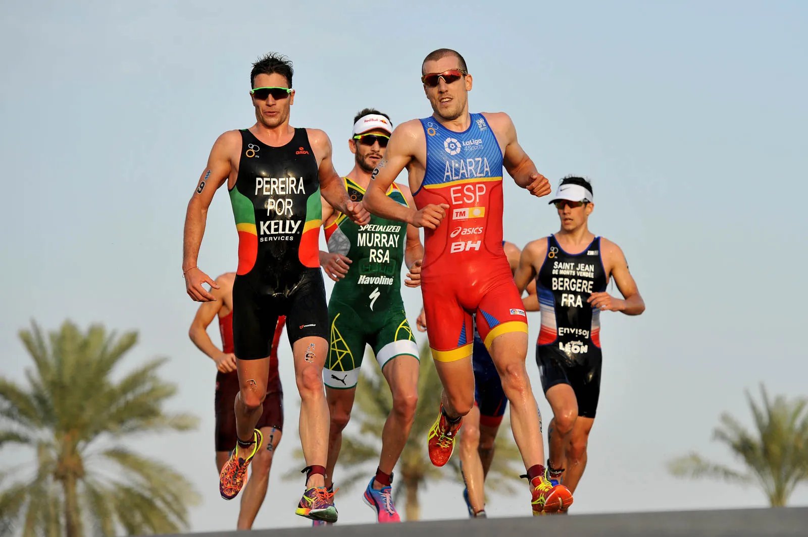
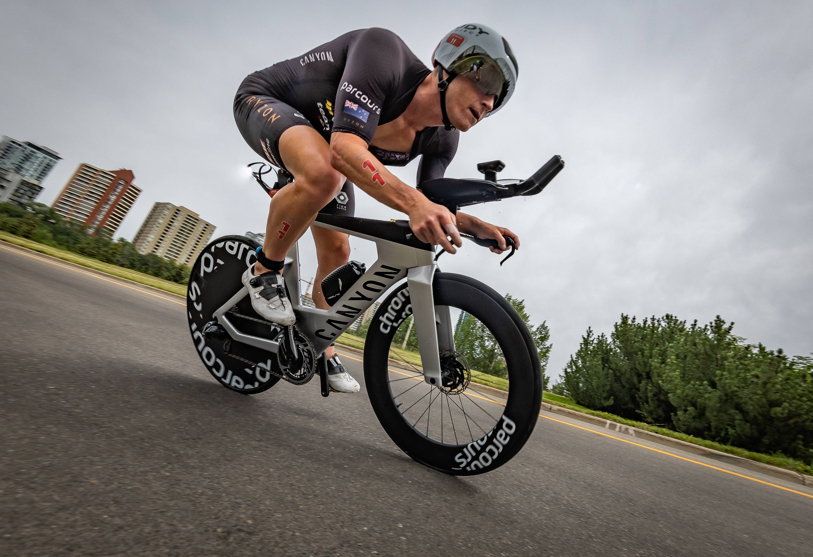
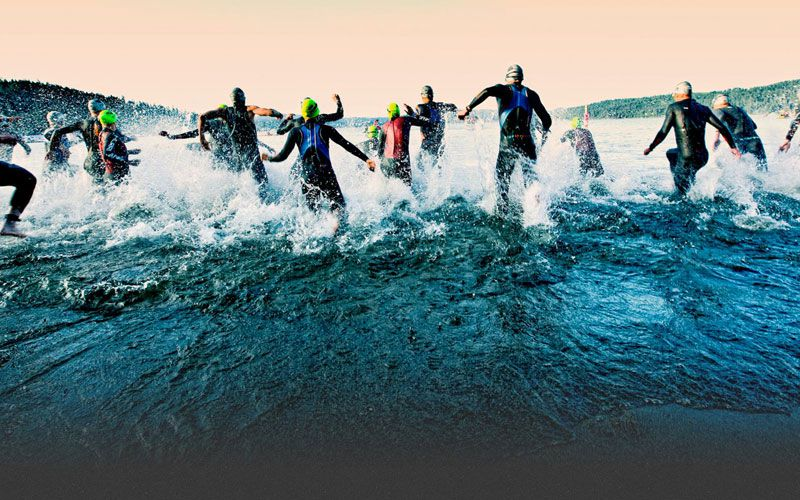

<!DOCTYPE html>
<html lang="pt-br">
    <head>
        <meta charset="UTF-8">
        <meta http-equiv="X-UA-Compatible" content="IE=edge">
        <meta name="viewport" content="width=device-width, initial-scale=1.0">
        <title>Triathlon</title>

        <link rel="stylesheet" href="_css/estilo.css">
        <link rel="shortcut icon" href="_img/index .ico" type="image/x-icon">

    </head>
    <body>

        <header><h1>Triathlon</h1></header>
        
        

            <section>

                
                <nav>

                    <ul>

                        <li><a href="corrida.html">Corrida</a></li>
                        &nbsp;
                        <li><a href="nataçao.html">Natação</a></li>
                        &nbsp;
                        <li><a href="cicclismo.html">Ciclismo</a></li>
                        &nbsp;
                        <li><a href="Distâncias.html">Distâncias Oficiais</a></li>

                    </ul>

                </nav>
                

                <article>
                    <h1>Origem do Triathlon</h1>
                    
O Triathlon surgiu em 1974 na cidade de San Diego, Califórnia (EUA). Um clube de atletismo enviou aos seus atletas uma planilha de treinamentos com exercícios de natação e ciclismo para que usassem nas férias. No retorno às atividades, os treinadores fizeram um teste para saber se os atletas haviam feito a “lição de casa”, que consistia em nadar 500 metros na piscina do clube, pedalar 12 quilômetros em um condomínio fechado ao lado do clube e, finalmente, correr 5 quilômetros na pista de atletismo.

                    <h1>Oque é o Triathlon</h1>
                    
Triatlo é uma palavra grega que designa um evento atlético composto por três modalidades. Atualmente, o nome triatlo é em geral aplicado a uma combinação de natação, ciclismo e corrida, nessa ordem e sem interrupção entre as modalidades.

                    <h1>Como entrou na olimpiada</h1>
                    
O ano 2000 representou um marco na história do Triathlon mundial. A modalidade passou a integrar oficialmente o programa olímpico nos Jogos de Sydney, na Austrália.

                
                </article>

                <Aside>
                    <ul>
                    
                        <li></li>
                        <li></li>
                        <li></li>
                    
                    </ul>
                </Aside>

            </section>
        

        <footer>

            
Todos os Direitos Reservados para Adan Cardoso© 

        </footer>

    </body>
</html>
